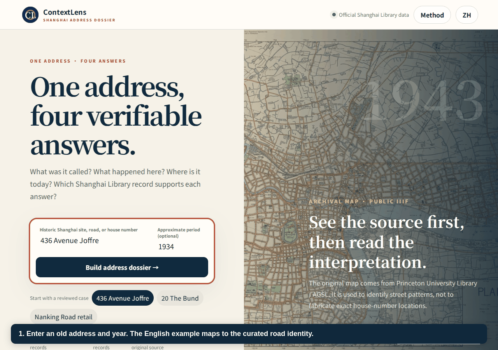
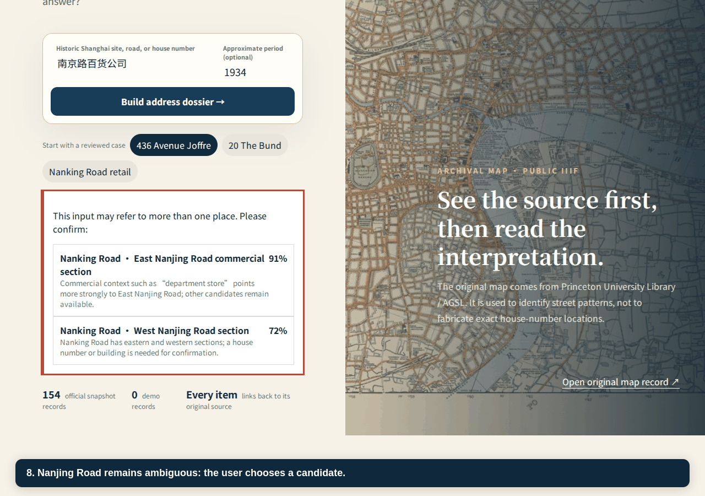
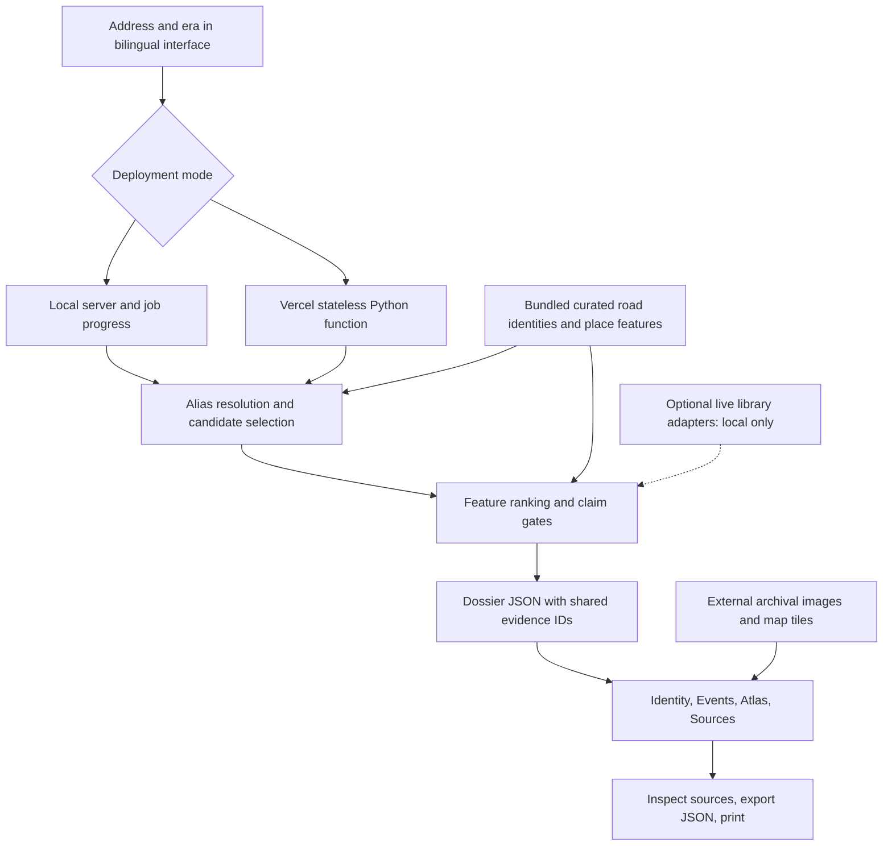

# 文脉镜 ContextLens

**An inspectable Shanghai historical-address dossier.** Enter an old address and
era, inspect its names and dated records, compare historical and modern maps, and
follow the evidence back to its source.

[Local launch](#local-launch) · [Deploy to Vercel](docs/VERCEL.md) ·
[Reproduce the demo](docs/REPRODUCIBILITY.md) · [Data card](docs/datasheet.md)

## One address, four views

| View | What the user can inspect |
|---|---|
| Identity | Historical and modern road names, name periods, candidate choices, and heuristic match confidence. |
| Events | Source-linked events and buildings with their recorded dates. |
| Atlas | An archival scan beside a contemporary map, with spatial uncertainty visible. |
| Sources | Evidence cards, Source Passports, original URIs, and downloadable dossier JSON. |

Try **436 Avenue Joffre, 1934**, **20 The Bund, 1930s**, or
**Nanjing Road department store**. The synthetic **9999 Mars Road** input demonstrates
the unresolved path. English examples use an explicit alias mapping; the interface
is not a general-purpose English historical geocoder.

## Annotated walkthrough

These GIFs are generated from actual browser states by
[scripts/capture_walkthrough.py](scripts/capture_walkthrough.py). Captions identify
the action and the evidence boundary; the frame durations do not represent latency.

### 1. Resolve an address and inspect its history



**Annotations:** enter the old address and year; inspect road-name periods; open
the dated event records. The era is a contextual hint, not a guarantee that every
displayed record belongs to that year.
[Static fallback](docs/media/01-address.png)

### 2. Inspect a Source Passport and export evidence


**Annotations:** distinguish the evidence returned for this address from the
collection total; inspect a card's identifier and source URI; download the same
claim-to-evidence links as JSON.
[Static fallback](docs/media/02-evidence.png)

### 3. Check ambiguity and missing evidence



**Annotations:** Nanjing Road requires candidate confirmation; an unsupported
address produces an unresolved result.
[Static fallback](docs/media/03-boundaries.png)

The [four-minute demo script](docs/tomorrow_demo_script.md) follows the same sequence.

## Software architecture



Both deployments call app/place_investigation.py. Local jobs retain progress in
server memory. The hosted adapter returns a complete dossier in one request,
without a database or cross-request job state.

The separate local research interface uses app/agent.py and a SQLite index of the
official snapshot. Optional model interpretation is a backend research feature;
the main four-view interface's three dossier questions use deterministic answers.
See [architecture details](docs/architecture.md).

## Data and provenance

The [official snapshot](data/processed/shlibrary_official_snapshot.json) contains
**154 records**: 71 buildings, 45 roads/place names, 23 organizations, 10 events,
and 5 people. Its metadata reports 93 source response files.

The main address demonstration uses source-linked curated road and place-feature
tables bundled in the code. The 154-record snapshot supports the separate indexed
research interface; it is not a per-query evidence count or an evaluation set.

Snapshot records preserve provider, dataset, original URI, evidence ID, retrieval
metadata, normalization label, and source-payload hash. Curated place cards retain
a smaller lineage contract. An official URI and a valid evidence ID establish
traceability, not historical truth. Distinct URIs do not establish independent
corroboration. Confidence scores are heuristics.

Date labels are preserved, but query-year compatibility is not universally
enforced by the present gates. The 1943 archival scan is shown beside the modern
map and is not represented as an audited house-number overlay.

## Local launch

Use **Python 3.11+**; Python **3.12** is recommended to match CI and Vercel.
The packaged frontend and core Python application need no model/library key or
Node.js installation for normal local use.

```bash
git clone https://github.com/sunshineluyao/ContextLens-aaai.git
cd ContextLens-aaai
python3 start.py
```

Open http://127.0.0.1:8765. Windows users can run python start.py.
The START_HERE_MAC.command, START_HERE_WINDOWS.bat, and START_HERE_LINUX.sh launchers
are also included.

The bundled local evidence flow can run offline. Historical scans, map tiles, and
original source pages require internet access.

## Git import deployment to Vercel Hobby

Follow the [step-by-step Vercel guide](docs/VERCEL.md). Import this personal fork,
use the repository root, choose **Other**, and keep the settings in vercel.json.
No environment variables, database, or paid API is required for the hosted demo.

| Setting | Value |
|---|---|
| Node.js | 24.x |
| Python | 3.12 |
| Install | npm ci |
| Build | npm run check && npm run build && python3 scripts/prepare_vercel.py |
| Output | dist |

After deployment, verify /api/health and all four acceptance cases, then add the
actual production URL here. A Vercel deployment has not been asserted merely
because this configuration exists. Hobby is limited to eligible personal,
non-commercial use and included usage quotas.

## Reproduction and validation

```bash
python3 -m pip install -r requirements-dev.txt
npm ci
npm run check
npm run build
python3 -m pytest -q
python3 scripts/demo_report.py
```

The original suite has 29 test functions; the serverless adapter adds 8 targeted
tests. Use the actual CI result for the collected/passed count. The report records
the tested commit, source checksums, query outputs, and measured case timings.
These are implementation and acceptance checks, not retrieval-accuracy or
user-study evidence.

[Reproduction instructions](docs/REPRODUCIBILITY.md) ·
[GitHub Actions](../../actions) ·
[Generated acceptance report](reproducibility/demo-report.json)

## Research boundaries and credit

The current system is a Shanghai-specific prototype. Expert review of aliases,
dates, source adequacy, and coarse coordinates remains necessary. The public
adapter does not retain address queries in application logs or call a model.
Hosting providers and external map/source services may process ordinary access
metadata.

Code is licensed under [Apache-2.0](LICENSE). Shanghai Library records and map
assets retain their source-specific rights and attribution requirements. The
project originated in the Shanghai Library Open Data Contest; this fork prepares
the address demo for research dissemination. Authorship, acknowledgments, and
submission links should be synchronized with the authors' final approved paper.
