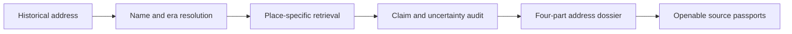

<div align="center">

# 文脉镜 ContextLens

### A Verifiable Shanghai Address Dossier

Turn one historical Shanghai address into four source-backed answers:
**what it was called, what happened there, where it is today, and which record supports every claim.**

<p>
  
  
  
  
</p>

<p>
  <a href="#-quick-start">Quick Start</a> ·
  <a href="#-the-four-answer-workflow">Product</a> ·
  <a href="#-evidence-and-data">Data</a> ·
  <a href="#-architecture">Architecture</a> ·
  <a href="#-validation">Validation</a>
</p>

</div>

---

## Why ContextLens?

Historical addresses are difficult to investigate. Street names change, house numbers become ambiguous, archival maps are imperfectly registered, and attractive narratives can easily outrun their evidence.

ContextLens treats an address as a **historical entity**, not merely a search phrase. It resolves old and modern names, connects directly relevant events and buildings, preserves uncertainty, and returns every important conclusion to an openable source.

> **ContextLens does not invent a story about an address. It compiles a dossier that can be questioned, checked, printed, and reused.**

## ✦ The Four-Answer Workflow

| Step | Question | What ContextLens returns |
|:---:|---|---|
| **01** | **What was this address called?** | Historical and modern street identities, name periods, ambiguity candidates, and resolution confidence |
| **02** | **What happened here?** | Location-specific events and buildings arranged by time, with uncertain dates kept visibly unresolved |
| **03** | **Where is it today?** | A real archival scan beside a contemporary map—without pretending an unaudited overlay is precise |
| **04** | **What supports the answer?** | A source receipt and passport for every evidence item: provider, dataset, date, evidence ID, normalization, and original URI |

### Three deliberately narrow questions

The interface does not begin with a vague chatbot. Questions are generated from the current dossier:

- Why did this road change names?
- What happened at this house number?
- What is still unknown?

Answers use only the active address evidence. Unsupported explanations remain unknown.

## ✦ Flagship Investigations

### `436 Avenue Joffre · 1930s`

Resolves Avenue Joffre to the present-day Huaihai Middle Road area, reconstructs the verified road-name sequence, and connects the 1934 Kangjian Bookstore event to its Shanghai Library source record.

### `20 The Bund · 1930s`

Connects a Bund address to buildings, institutions, and the changing urban waterfront while preserving the difference between a verified coordinate and a broader location range.

### `Nanjing Road department store · 1940s`

Demonstrates ambiguity handling: ContextLens returns East and West Nanjing Road candidates instead of silently selecting the wrong place.

### Negative control: `9999 Mars Road`

Returns an unresolved result and asks for better evidence. It does **not** generate historical facts.

## ✦ Evidence and Data

The repository includes a reproducible, credential-free snapshot containing:

<div align="center">

| Official snapshot | Preserved responses | Demo records |
|:---:|:---:|:---:|
| **154 records** | **93 responses** | **0** |

</div>

Primary Shanghai Library data families include:

- Shanghai road and place-name entities
- Shanghai historical and cultural events
- Shanghai outstanding historical buildings
- Person authority records
- Shanghai yearbook organization records

Each normalized record retains a lineage object containing the provider, dataset, query term, retrieval time, official URI, payload hash, normalization version, evidence ID, and source mode.

Auxiliary visual sources are kept clearly separate:

- **Princeton University Library / AGSL** — 1943 *Plan of Shanghai* public IIIF image
- **OpenFreeMap / OpenMapTiles / OpenStreetMap** — contemporary geographic orientation
- **Virtual Shanghai and Wikimedia Commons** — historical-map catalogue metadata where applicable

Historical scans are never presented as exact house-number overlays unless their registration has passed an explicit accuracy audit.

## ✦ Product Principles



1. **Evidence before narrative** — source records appear before interpretation.
2. **Unknown means unknown** — missing dates and approximate locations stay visible.
3. **No false precision** — archival scans and present-day maps are read side by side.
4. **Official and auxiliary sources remain distinct** — provenance is never flattened.
5. **One complete public task** — the product optimizes for investigating an address, not for displaying every possible research tool.

## ✦ Quick Start

### One-click local launch

Requirements: **Python 3.11 or newer**. The packaged product does not require a Shanghai Library API key, a model key, or Node.js.

| Platform | Launch method |
|---|---|
| macOS | Double-click `START_HERE_MAC.command` |
| Windows | Double-click `START_HERE_WINDOWS.bat` |
| Linux | Run `./START_HERE_LINUX.sh` |

Or start it from a terminal opened in the extracted project folder:

```bash
python3 start.py
```

Open [http://127.0.0.1:8765](http://127.0.0.1:8765). Stop the service with `Ctrl+C`.

Use another port if needed:

```bash
CONTEXTLENS_PORT=8777 ./start-contextlens
```

### Frontend development

Node.js is required only when editing the frontend:

```bash
npm ci
npm run check
npm run build
./start-contextlens
```

## ✦ Architecture

```text
ContextLens/
├── frontend/src/          # Four-part dossier interface
├── app/
│   ├── place_investigation.py  # Address resolution and investigation pipeline
│   ├── official_snapshot.py    # Reproducible Shanghai Library snapshot builder
│   ├── storage.py              # Local evidence index
│   ├── historical_maps.py      # Archival-map catalogue and source boundaries
│   ├── agent.py                # Evidence-grounded research tools
│   └── memory_web.py           # Local HTTP application and API
├── data/processed/
│   └── shlibrary_official_snapshot.json
├── tests/                 # Address, evidence, privacy, and regression tests
└── start.py               # Cross-platform application entry point
```

The primary investigation lifecycle is:

```text
queued → resolving → fetching → linking → auditing → complete
```

### Core endpoints

| Method | Endpoint | Purpose |
|---|---|---|
| `GET` | `/api/health` | Evidence coverage and service health |
| `POST` | `/api/place/resolve` | Resolve an address into one or more place candidates |
| `POST` | `/api/investigations` | Start an evidence-bound address investigation |
| `GET` | `/api/investigations/{id}` | Read progress or the completed dossier |
| `POST` | `/api/ask` | Access the secondary evidence-research interface |

## ✦ Optional Live Data

The packaged official snapshot is sufficient for the reviewed experience. For authorized development against live services:

```bash
cp .env.example .env
```

Then configure locally:

```dotenv
SHLIB_API_KEY=your_key_here
DEEPSEEK_API_KEY=optional_key_here
```

`.env`, API caches, logs, SQLite indexes, and local runtime data are excluded from Git. API keys never enter source URLs, cache filenames, frontend code, or audit logs.

## ✦ Validation

```bash
npm run check
npm run build
python3 tests/test_place_investigation.py
python3 tests/test_agent.py
```

Current verified state:

- TypeScript validation: **passed**
- Production frontend build: **passed**
- Place-investigation regression suite: **passed**
- Agent regression suite: **14/14 passed**
- Official snapshot records: **154**
- Demo records in the normal product path: **0**

The tests cover old-name resolution, ambiguity, negative cases, source lineage, relationship gating, network failure, privacy-safe audit logs, TLS verification, asynchronous investigation states, and evidence-bound UI contracts.

## ✦ Privacy and Research Boundaries

- ContextLens does not request GPS, camera, microphone, or browser-history access.
- Query audit logs store irreversible hashes rather than raw addresses.
- Missing coordinates remain approximate or unresolved.
- Unverified archival registration is never presented as precise georeferencing.
- An absent source is never replaced with an unrelated record merely to increase evidence count.
- Optional model assistance is not required for the core product.
- ContextLens is a public-history research prototype, not legal, financial, or regulatory advice.


---

<div align="center">

**ContextLens · Shanghai Address Dossier**

Built with respect for historical uncertainty, open data, and the people who will verify the story.

</div>
