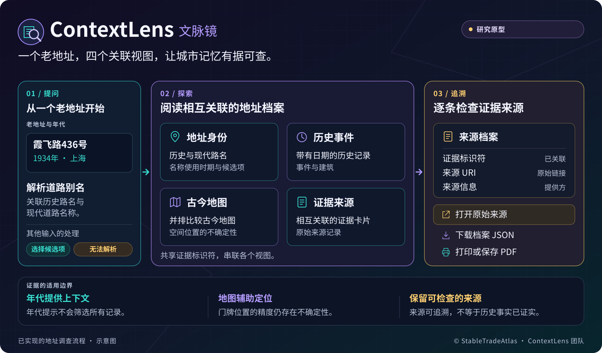
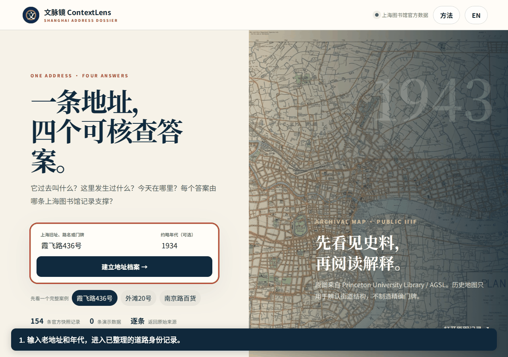
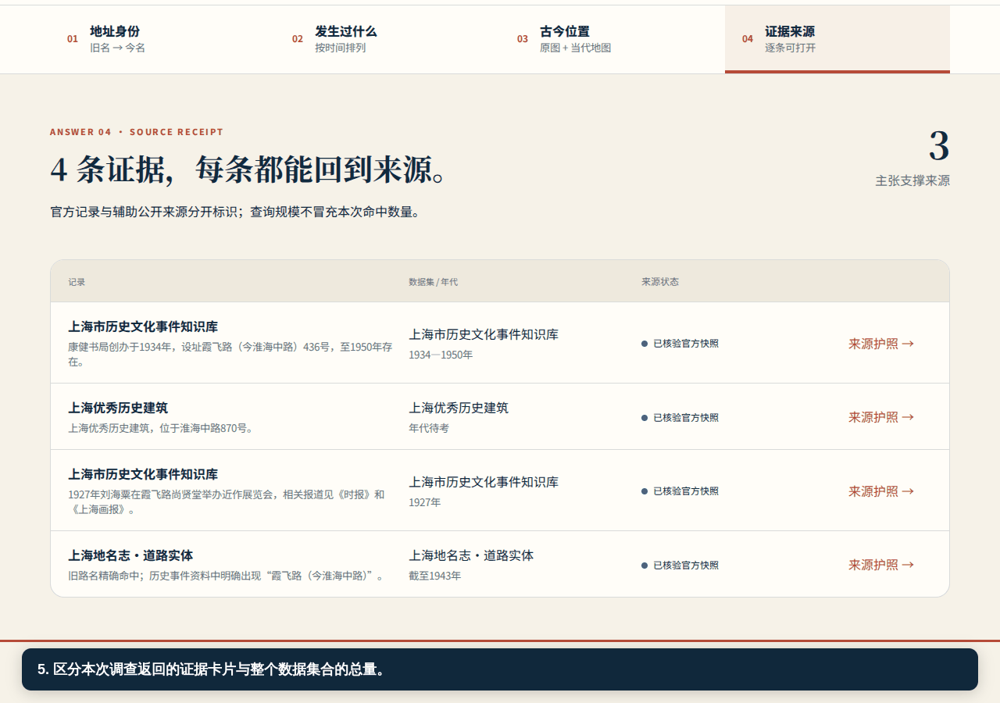
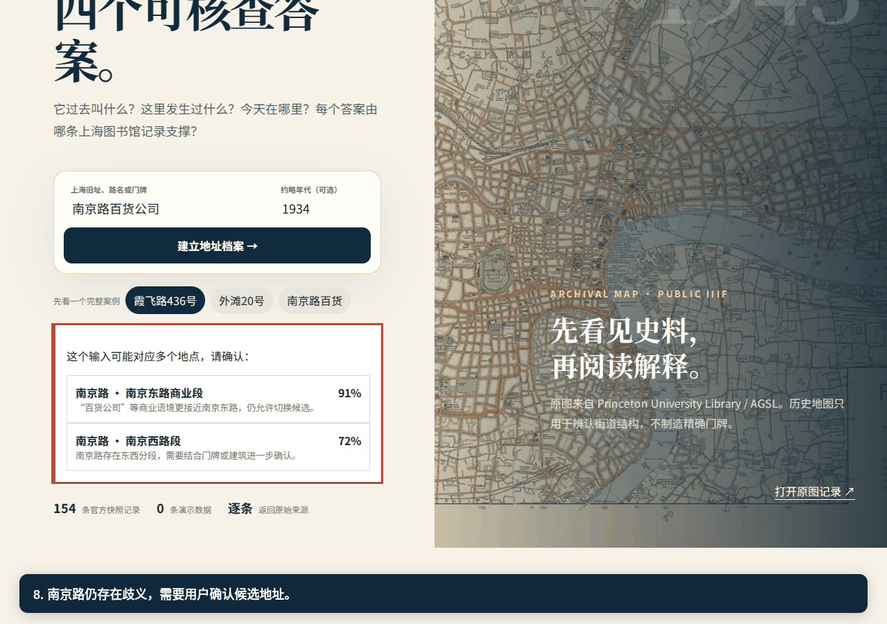
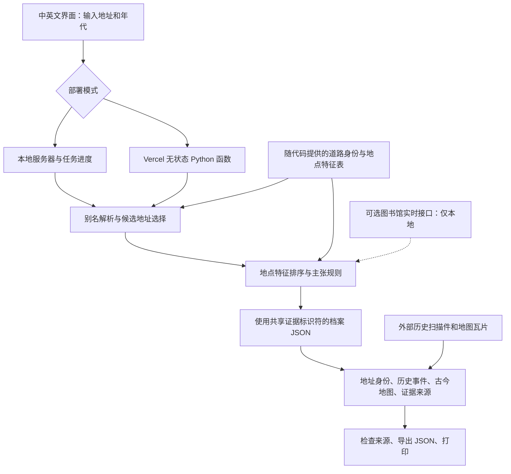

<h1 align="center">文脉镜 · ContextLens</h1>

<p align="center"><a href="README.md">English</a> | <strong>简体中文</strong></p>

<p align="center"><strong>从一个老地址，走进上海的城市记忆。</strong><br>
历史路名 · 年代记录 · 古今地图 · 可追溯的来源</p>

<p align="center">
  <a href="https://openreview.net/profile?id=~Shilin_Ou1">Shilin Ou</a> ·
  <a href="https://openreview.net/profile?id=~Sean_Wan1">Sean Wan</a> ·
  <a href="https://openreview.net/profile?id=~Polina_Postnikova1">Polina Postnikova</a> ·
  <a href="https://openreview.net/profile?id=~Yutian_Wang3">Yutian Wang</a> ·
  <a href="https://openreview.net/profile?id=~Luyao_Zhang1">Luyao Zhang</a>
  <br><a href="https://github.com/StableTradeAtlas/ContextLens-aaai">StableTradeAtlas · ContextLens 团队</a>
</p>

<p align="center">
  <a href="docs/media/contextlens-teaser.zh-CN.svg"></a>
</p>

<p align="center"><em>把一个地址整理成相互关联的档案，让每条线索都能回到来源。</em><br>
<a href="docs/media/contextlens-teaser.zh-CN.svg">查看完整 SVG</a> · <a href="docs/media/contextlens-teaser.zh-CN.png">下载 PNG</a> · <a href="docs/media/README.md">图示与录屏说明（英文）</a></p>

<p align="center">
  <a href="#本地启动"></a>
  <a href="LICENSE"></a>
  <a href="#切换语言"></a>
  <a href="#通过-git-导入部署到-vercel"></a>
  <a href="#复现与验证"></a>
</p>

<p align="center">
  <a href="#本地启动">🚀 本地启动</a> ·
  <a href="#带注释的操作演示">▶️ 观看演示</a> ·
  <a href="#软件架构">🧩 软件架构</a> ·
  <a href="#数据与来源">📚 数据与来源</a>
</p>

输入老地址和年代，即可查看路名变化、带日期的历史记录、古今地图和原始来源。
上方图示说明已实现的地址调查流程；下方动图展示实际运行的中文界面。

## 切换语言

本页提供[英文版](README.md)和**简体中文版**，分别配有对应语言的图示与操作录屏。
应用默认以中文打开。点击右上角的 **EN** 切换到英文；在英文界面中点击 **ZH** 切换回中文。

## 一个地址的四个视图

| 视图 | 可以查看的内容 |
|---|---|
| 地址身份 | 历史与现代路名、名称使用时期、候选地址，以及启发式匹配置信度。 |
| 历史事件 | 与来源关联的事件和建筑记录，以及记录中的日期。 |
| 古今地图 | 并排查看历史地图扫描件与现代地图，并了解空间位置的不确定性。 |
| 证据来源 | 证据卡片、来源档案、原始 URI，以及可下载的档案 JSON。 |

可以尝试 **霞飞路436号，1934年**、**外滩20号，1930年代**，或 **南京路百货公司**。
虚构输入 **9999 Mars Road** 用于展示无法解析的情况。
英文示例通过明确的别名映射进入已整理的道路记录；当前系统并非通用的英文历史地址地理编码器。

## 带注释的操作演示

以下动图由[录屏脚本](scripts/capture_walkthrough.py)从实际浏览器状态生成。
中文标注说明操作与证据边界；画面停留时间不代表系统响应时间。
[英文版 README](README.md#annotated-walkthrough)提供对应的英文录屏。

### 1. 解析地址并查看历史



**操作说明：** 输入地址和年代；查看路名使用时期；打开带日期的历史记录；比较历史扫描件与现代地图。
年代输入提供上下文提示，不保证每一条显示记录都属于该年。
[静态图片](docs/media/01-address.zh-CN.png)

**录屏边界：** 此前的英文 CI 录屏加载了历史地图扫描件，但外部现代底图未能显示。
地图服务受网络状态影响；中文录屏也保留实际加载状态。部署后应单独检查在线底图。

### 2. 查看来源档案并导出证据



**操作说明：** 区分本次地址调查返回的证据与整个数据集合的总量；检查证据标识符和原始 URI；
下载包含相同主张与证据关联的 JSON。
[静态图片](docs/media/02-evidence.zh-CN.png)

### 3. 查看歧义与证据不足的情况



**操作说明：** 南京路示例需要用户确认候选地址；不受支持的地址返回无法解析的结果。
[静态图片](docs/media/03-boundaries.zh-CN.png)

| 步骤 | 操作 | 重点检查 |
|---|---|---|
| 🔎 解析 | 输入地址与年代，必要时确认候选项。 | 古今路名、带日期的记录和地图视图。 |
| 📑 追溯 | 打开来源档案，再下载调查结果。 | 证据标识符、原始 URI、主张与证据的关联。 |
| 🧭 检查边界 | 尝试有歧义及不受支持的输入。 | 无法唯一匹配时显示的候选项或无法解析状态。 |

详细的[演示步骤说明](docs/demo_walkthrough.md)目前为英文。

## 软件架构



两种部署模式都调用 `app/place_investigation.py`。本地任务在服务器内存中保存进度；
托管适配器在一次请求中返回完整档案，不依赖数据库或跨请求的任务状态。

独立的本地研究界面使用 `app/agent.py` 及官方快照的 SQLite 索引。
可选模型解释属于后端研究功能；主要四视图界面中的三个档案问题使用确定性回答。
更多细节见[架构说明（英文）](docs/architecture.md)。

## 数据与来源

[官方快照](data/processed/shlibrary_official_snapshot.json)包含 **154 条记录**：
71 条建筑、45 条道路或地名、23 条机构、10 条事件和 5 条人物记录。
快照元数据记载了 93 个来源响应文件。

主要地址演示使用代码中随附的、带来源链接的人工整理道路与地点特征表。
154 条记录的官方快照用于独立的索引研究界面，不能当作单次查询的证据数量或评估集。

快照保留提供方、数据集、原始 URI、证据标识符、获取元数据、规范化标签和来源载荷哈希。
人工整理的地点卡片保留较少的来源字段。官方 URI 和有效证据标识符支持来源追溯，
不能证明历史叙述为真；不同 URI 也不必然代表独立佐证。置信度分数是启发式指标。

系统保留日期标签，但当前规则不会普遍按输入年代筛选所有记录。
1943 年历史地图扫描件与现代地图并排展示，不能视为经过审核的精确门牌叠加图。

## 本地启动

需要 **Python 3.11 或更高版本**；建议使用 **Python 3.12**，与 CI 和 Vercel 保持一致。
正常本地使用已打包的前端和核心 Python 应用时，无需模型或图书馆 API 密钥，也无需安装 Node.js。

在解压后的项目目录中打开终端：

```bash
python3 start.py
```

随后打开 http://127.0.0.1:8765 。Windows 用户可以运行 `python start.py`。
项目也提供 `START_HERE_MAC.command`、`START_HERE_WINDOWS.bat` 和 `START_HERE_LINUX.sh` 启动器。

随代码提供的本地证据流程可以离线运行；历史扫描件、地图瓦片与原始来源网页需要联网。

## 通过 Git 导入部署到 Vercel

在符合 Vercel Hobby 使用条件的个人账户中：

1. 打开 Vercel，选择 **Add New → Project**，通过 GitHub 导入本仓库。
2. 使用仓库根目录，将框架设为 **Other**。
3. 保留 `vercel.json` 中的设置，并核对下表。
4. 点击 **Deploy**，等待状态变为 **Ready**。
5. 打开部署地址的 `/api/health`，检查 `ok: true`、`official_records: 154` 和 `investigation_mode: "synchronous"`。
6. 测试霞飞路、外滩、南京路歧义输入，以及 `9999 Mars Road`；检查四个视图、JSON 下载、刷新页面和未登录访问。

| 设置 | 值 |
|---|---|
| Node.js | `24.x` |
| Python | `3.12` |
| 安装命令 | `npm ci` |
| 构建命令 | `npm run check && npm run build && python3 scripts/prepare_vercel.py` |
| 输出目录 | `dist` |

托管演示无需设置环境变量、数据库或付费 API。Hobby 的使用范围与额度以平台规则为准，
包括适用的个人非商业用途限制。完整设置与故障排查见[Vercel 部署指南（英文）](docs/VERCEL.md)。

仓库已提供部署配置，但尚未在文档中确认实际生产网址。完成上述检查后，再补充经过验证的访问链接。

## 复现与验证

```bash
python3 -m pip install -r requirements-dev.txt
npm ci
npm run check
npm run build
python3 -m pytest -q
python3 scripts/demo_report.py
```

原始测试集包含 29 个测试函数，无服务器适配器增加了 8 个针对性测试；
实际收集和通过的测试数量以 CI 输出为准。报告记录被测提交、来源校验和、查询输出及各案例耗时。
这些是实现与验收检查，不能视为检索准确率或用户研究证据。

[复现说明（英文）](docs/REPRODUCIBILITY.md) · [生成的验收报告](reproducibility/demo-report.json)

如需重新生成中文录屏，在完成上述前端构建后运行：

```bash
python3 scripts/prepare_vercel.py
python3 -m playwright install --with-deps chromium
python3 scripts/capture_walkthrough.py --language zh
```

`--language en` 生成英文录屏，也是脚本的默认设置。录制机器需要可显示中文的字体；
CI 使用 Noto CJK。中英文图示的 PNG 可以通过 `python3 scripts/render_readme.py` 重新导出。

## 适用范围与版权

当前系统是面向上海历史地址的研究原型。道路别名、日期、来源充分性和粗略坐标仍需要专家检查。
公共适配器不会把地址查询保存在应用日志中，也不会调用模型；
托管平台和外部地图或来源服务可能处理通常的访问元数据。

版权所有 © **StableTradeAtlas 的 ContextLens 团队**。
本仓库派生自该组织的 [ContextLens-aaai 仓库](https://github.com/StableTradeAtlas/ContextLens-aaai)。
作者顺序与仓库来源见 [NOTICE](NOTICE)。

代码采用 [Apache-2.0](LICENSE) 许可证。上海图书馆记录、历史扫描件和地图素材保留各自的版权与署名要求。
