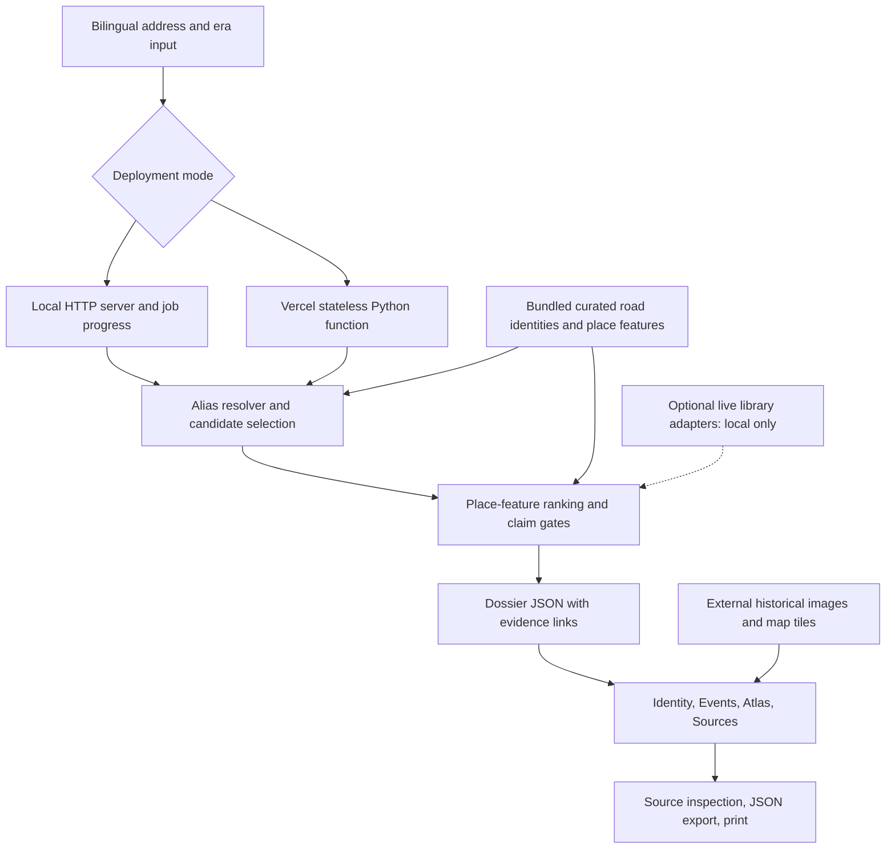

# ContextLens software architecture

The public product is a four-view address dossier. Both deployment modes call the
same resolver, place-feature ranking, and claim-gating code.

## Data contracts

The main address flow uses PlaceCandidate, HistoricalFeature, and HistoricalClaim
objects in app/models.py. The legacy research interface uses EvidenceRecord and a
SQLite index populated from the 154-record official snapshot. The address route
uses bundled curated features in app/place_investigation.py and optional live
adapters; it does not search all 154 indexed records for each address.

Snapshot records retain payload hashes and retrieval metadata. Curated address
cards retain source URI, evidence ID, provider, and normalization metadata, but do
not all carry the snapshot's complete retrieval lineage. Do not describe those
contracts as identical without adding and validating the missing fields.

## Evidence boundaries

Individual direct claims require a named-place match, an eligible dated event or
addressed building, a source URI, and the requested house-number match. A separate
road-level synthesis can combine multiple distinct source URIs. A distinct URI is
not proof of independent historical corroboration.

Dates are preserved and shown; the present implementation does not universally
filter records by compatibility with the requested year. Era input also guides
historical-map context. Resolver confidence values are heuristics, not calibrated
probabilities.

## Optional research interface

Local /research-tools and /api/ask retain the wider historical research interface.
A backend interpretation endpoint can invoke an optional model. The main four-view
frontend does not call that endpoint; its three dossier questions are deterministic.
Citation-ID filtering checks references, not whether generated prose is entailed.
The Vercel adapter exposes only the credential-free address flow.

## Reproduction

See [REPRODUCIBILITY.md](REPRODUCIBILITY.md) and [VERCEL.md](VERCEL.md).
